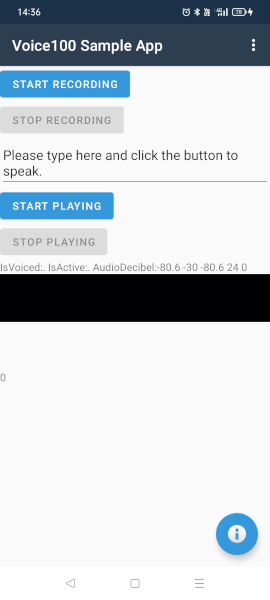

# Voice100 Xamarin Android App

Voice100 Android App is a TTS/ASR sample app that uses 
[ONNX Runtime](https://github.com/microsoft/onnxruntime/),
[WORLD](https://github.com/mmorise/World)
and [Voice100](https://github.com/kaiidams/voice100) neural TTS/ASR models
on [Xamarin](https://dotnet.microsoft.com/apps/xamarin).
Inference of Voice100 is low cost as its models are tiny and only depend
on CNN without recursion.



## Building

### World

Build for libworld.a for `armeabi-v7a`, `arm64-v8a`, `x86`, `x86_64`.

```
set ANDROID_SDK=%USERPROFILE%\AppData\Local\Android\Sdk
set CMAKE=%ANDROID_SDK%\cmake\3.10.2.4988404\bin\cmake.exe
set CMAKE_TOOLCHAIN_FILE=%ANDROID_SDK%\ndk\21.4.7075529\build\cmake\android.toolchain.cmake
rem set ANDROID_ABI=armeabi-v7a
set ANDROID_ABI=arm64-v8a
rem set ANDROID_ABI=x86
rem set ANDROID_ABI=x86_64

git clone https://github.com/mmorise/World.git
cd World
md build\%ANDROID_ABI%-android
cd build\%ANDROID_ABI%-android
%CMAKE% ^
    -DCMAKE_TOOLCHAIN_FILE=%CMAKE_TOOLCHAIN_FILE% ^
    -G Ninja ^
    -DANDROID_ABI=%ANDROID_ABI% ^
    -DANDROID_NATIVE_API_LEVEL=26 ^
    ..\..
ninja
```

### libvoice100_native.so

```
set WORLD_ROOT=...
cd native
md build\%ANDROID_ABI%-android
cd build\%ANDROID_ABI%-android
%CMAKE% ^
    -DCMAKE_TOOLCHAIN_FILE=%CMAKE_TOOLCHAIN_FILE% ^
    -G Ninja ^
    -DANDROID_ABI=%ANDROID_ABI% ^
    -DANDROID_NATIVE_API_LEVEL=26 ^
    -DWORLD_INC=%WORLD_ROOT%\src ^
    -DWORLD_LIB=%WORLD_ROOT%\build\%ANDROID_ABI%-android ^
    ..\..
ninja
copy libvoice100_native.so ..\..\..\Voice100AndroidApp\lib\%ANDROID_ABI%
```
